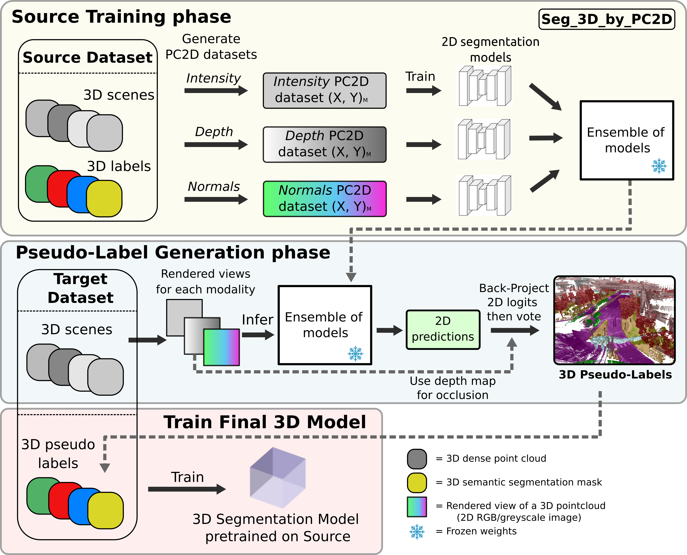

# Multi-View Projection for Unsupervised Domain Adaptation in 3D Semantic Segmentation

Official PyTorch implementation of the method **Seg_3D_by_PC2D**. More details can be found in the paper:

**Multi-View Projection for Unsupervised Domain Adaptation in 3D Semantic Segmentation**, (preprint) [[arXiv to come](https://arxiv.org/html/2505.15545v1)]
by *Andrew Caunes, Thierry Chateau, Vincent Frémont*




## Implementation details

[classes_dicts.py](./classes_dicts.py) provides utilities and dictionaries to map the classes of nuScenes and SemanticKITTI.
Example of usage:
This will print infos on the mapping between the UDA classes system
used for Unsupervised Domain Adaptation experiments and the classes of the SemanticKITTI dataset.
```bash
python3 classes_dicts --cs1 semantickitti_uda --cs2 uda
```
other classes systems include:
- `uda`: the classes system used for the Unsupervised Domain Adaptation experiments (includind `manmade')
- `semantickitti_uda`: the original classes of the SemanticKITTI dataset, ready to be mapped to the UDA classes system
- `nuscenes_uda`: the classes of the nuScenes dataset, ready to be mapped to the UDA classes system
